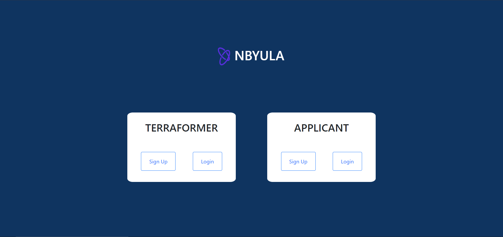
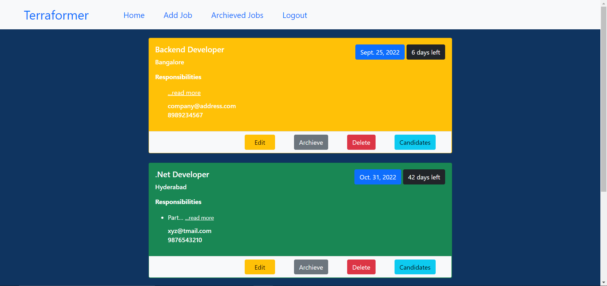
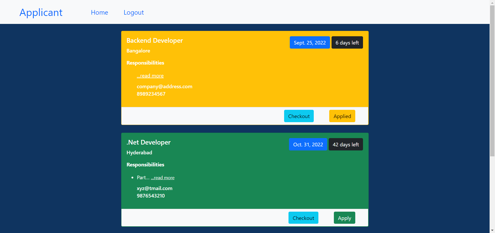
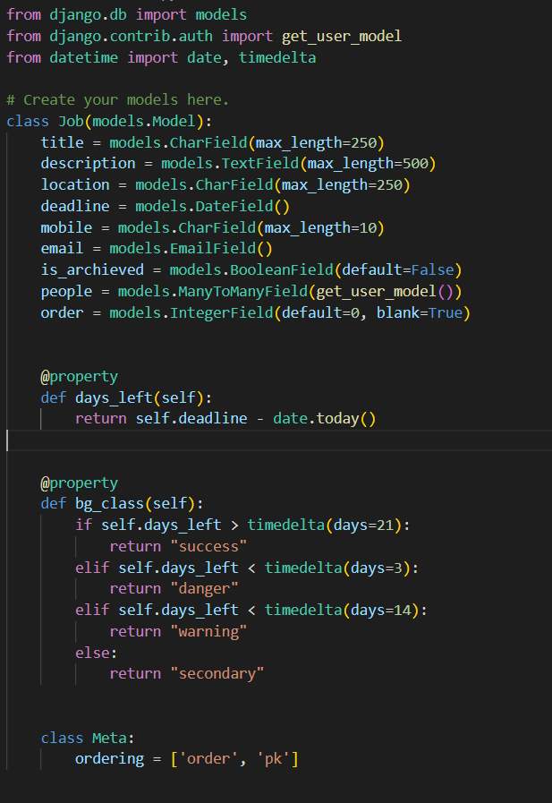
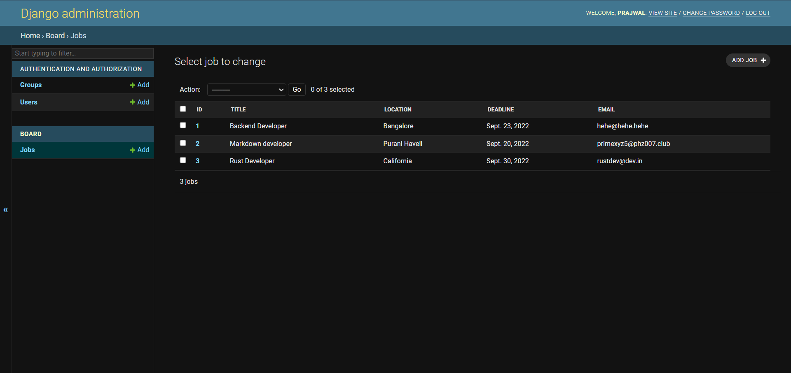

# Job Board [(Checkout)](https://prajwal-job-board.herokuapp.com/)


### What's Special?
1. Integrated Admin panel for full control of the Application. 
2. CSRF verification with django's middleware with every form submission. 
3. Session based Authentication system. 
4. Authenticated and authorized access to all the URLs.
5. Sclabale databse Design
6. GitHub account linked with Heroku for pipeline like deployment.
7. Smooth UI experience
8. Stateless application hence uses Heroku Postgres as database.
9. Dedicated Backend messages displayed on frontend for various invalid and valid requests.


### Flow of the Web Application:
- The web application opens up with a page with login and signup options in two categories: "Terraformers" and "Applicants".


- Depending on which group you are part of you can see the respective list of doable tasks. Your group will be displayed on the top left corner of the screen. 
    
>    - If you are a Terraformer:
        - You have the power to add, delete, edit and archieve the job openings for everyone else.
        - You can view the Interested candidates for each job in the job board. 
        - You can drag and drop to adjust the jobs.
        - Your dashboard will look like this one:

    
>    - If you are an Applicant:
        - You can checkout and apply for the job openings.
        - Your dashboard will look like this one:



### The Database Design of the Application:
>    1. User Table:
        - Default table provided by Django with many features such as authentication and authorization.
        - Maintains 
```[ Username, First Name, Last Name, Email, Password ]``` 

>    2. Group Table:
        - It is also a default table provided by Django for Authentication and Authorization purposes.
        - Two groups 
```[ Terraformer, Applicant ]``` 
        are created and assigned to the users at the time of signup.
        - With the help of this group the web application decides the authorization of a user.

>    3. Job Table:
        - This is the cutom table made by me for maintaining jobs and their relations with the user.
        - It has 
```[ Title, Description, location, deadline, mobile, email, is_archived, people, order ]``` 
            as fields and it also has many properties to support the business logic when needed. Here's a glimpse from the code:


    - You can see the tables from admin panel too:



### Tools and Technologies Used:
    - These were used for the devlopment and deployment of the application:
```[ Django, Python, SQLlite, Git, GitHub, Heroku, Heroku Postgres, HTML, CSS, Bootstrap, JavaScript ]``` 
    
     
## Design Decisions:
1. Database was designed so that user and Job data is maintained separately and are related with many to many relationship.
2. This avoids redundancy in the database and makes it scalable and efficient. 
3. Django was used so that in future it can be helpful in scaling and maintaining the website as it grows.
4. HTML, CSS and Bootstrap was used along with Django Templates to build frontend to avoid redundant code and functionality in frontend.


## Deployment Details:
- Used Heroku for Deployment thus application is stateless.
- Used SQLlite for devlopment and Heroku Postgres for deployment.
- Linked heroku with github repository for seamless deployment.

> Hope you like my profile. Suggestions are welcome.
> want to know more about me? 
[(Checkout)](https://prajwal-rai-e-resume.herokuapp.com/)